# 🏛️ Hacettepe Community & Event Portal (Web GIS)

**Hacettepe Event Portal** is a specialized **Web GIS platform** designed to bridge the gap between student communities (like GMT, HEK, HENDS) and students. It visualizes campus events on an interactive map, managing real-time data flow with a robust backend.

The system features a robust backend API, secure authentication (RBAC), and an interactive map interface to show where campus events (ice skating, workshops, meetings) are taking place.

---

## 🌟 1. User Journey & Interface (Frontend)
The application features a secure and interactive user journey, ensuring legitimate student access and role-based features.

### 🏛️ Landing & Verification
Users land on a clean portal interface. To ensure security, we implemented a **6-digit Email Verification** system.
<table border="0">
  <tr>
    <td width="50%" align="center">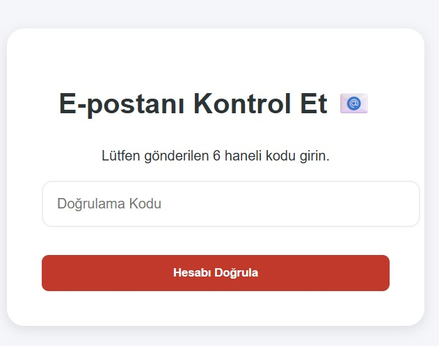</td>
    <td width="50%" align="center">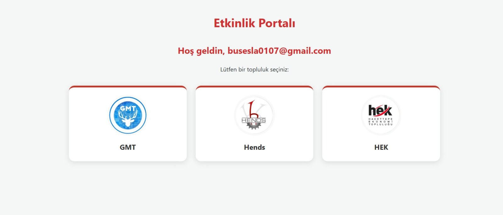</td>
  </tr>
</table>
*(Left: Landing Page, Right: Email Verification Modal)*

### 👥 Onboarding & Roles
Upon login, users select their affiliated community. A "Community Leader" sees different options (like **Create Event**) compared to a regular student.
<table border="0">
  <tr>
    <td width="50%" align="center">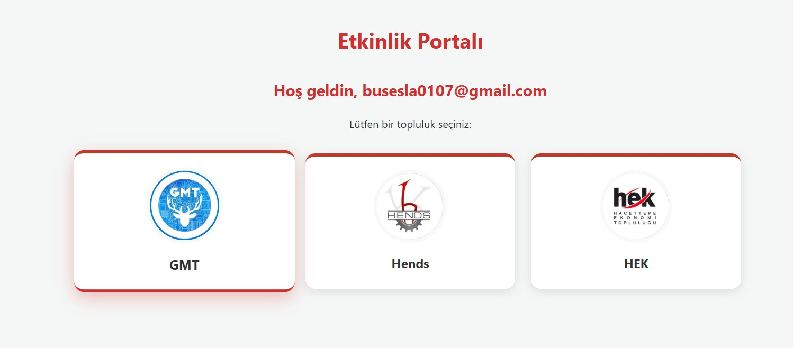</td>
    <td width="50%" align="center">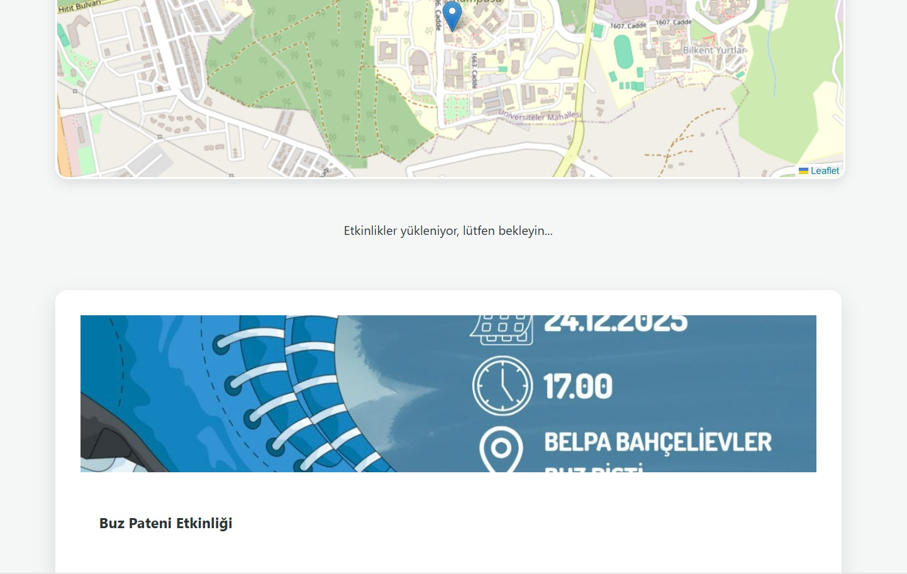</td>
  </tr>
</table>
*(Left: Community Selection Dashboard, Right: Profile with RBAC Controls)*

### 🌍 Interactive GIS Event Map
The core feature: Events are rendered on a **Leaflet/OpenLayers** map. Clicking a marker reveals dynamic event cards.
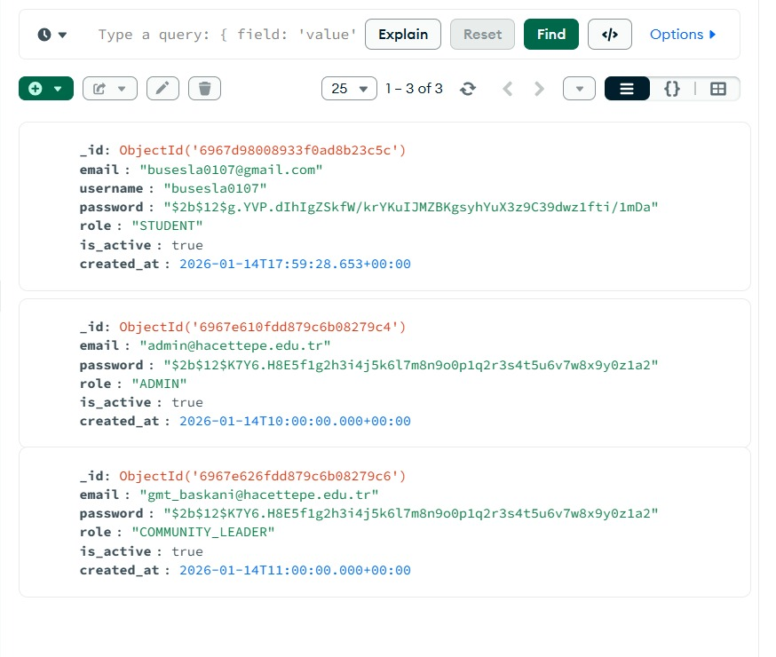

---

## 🛠️ 2. Backend & Database Architecture

The system is built on a **Modern Tech Stack** using MongoDB for flexible data storage and Swagger for API documentation.

### 🗄️ MongoDB Implementation (NoSQL)
User roles (`STUDENT`, `ADMIN`, `COMMUNITY_LEADER`) and event data are stored in **MongoDB Atlas**.
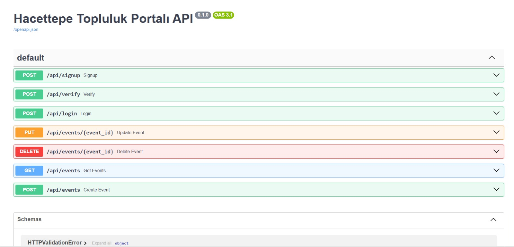

### 📄 API Documentation (Swagger)
All endpoints (Auth, Events, Users) are fully documented using **OpenAPI 3.0 / Swagger UI**.
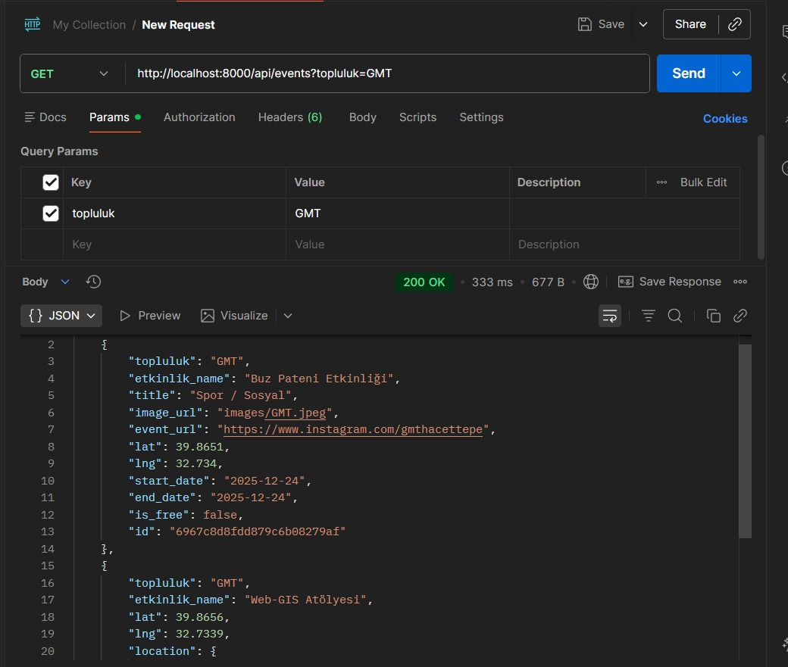

---

## 📡 3. API CRUD Proofs (Postman Testing)

The backend RESTful API supports full **CRUD (Create, Read, Update, Delete)** operations.

### 🔹 READ (GET) & CREATE (POST)
Fetching events returns geospatial data (`lat`, `lng`). Creating events is restricted to authorized leaders.
<table border="0">
  <tr>
    <td width="50%" align="center">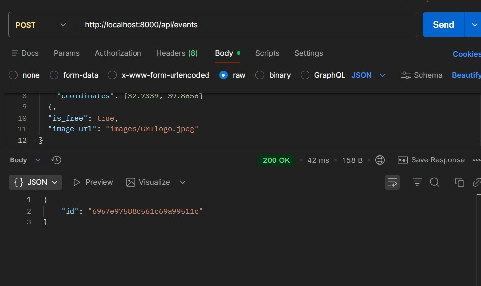</td>
    <td width="50%" align="center">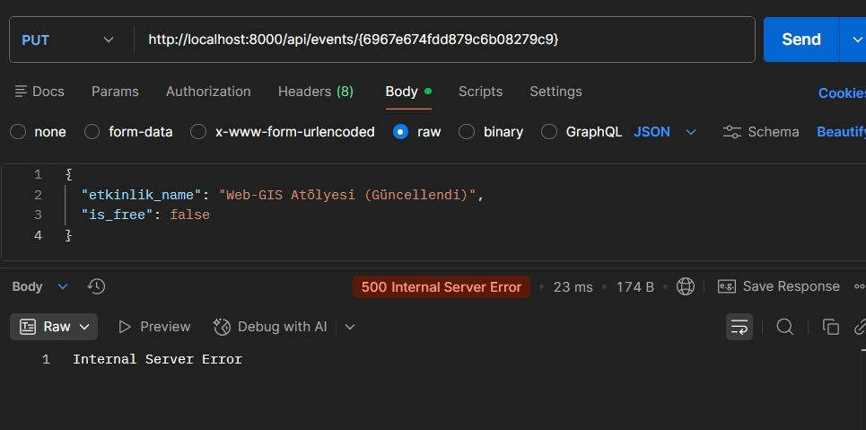</td>
  </tr>
</table>

### 🔹 UPDATE (PUT) & DELETE
Modifying event details or removing cancelled events.
<table border="0">
  <tr>
    <td width="50%" align="center">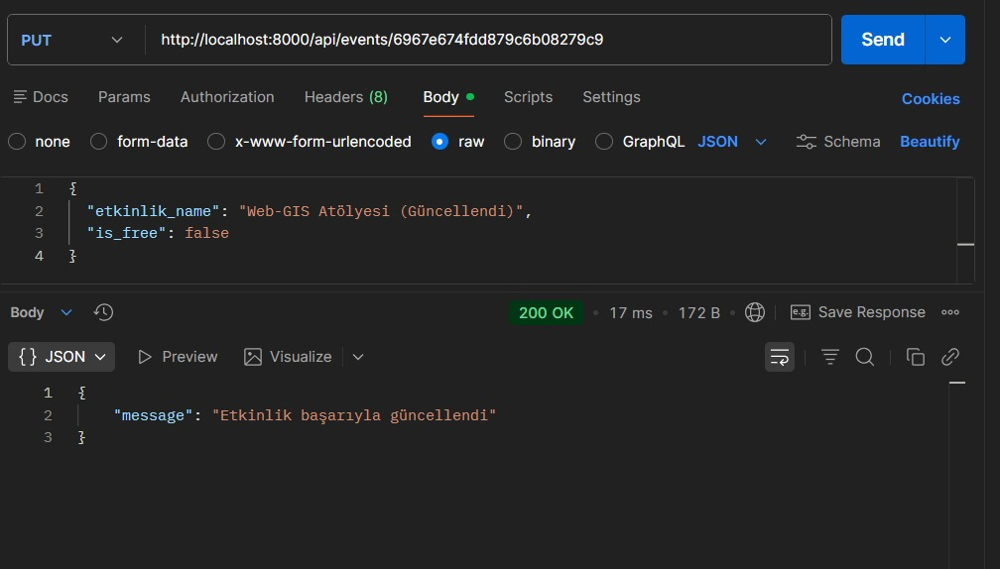</td>
    <td width="50%" align="center">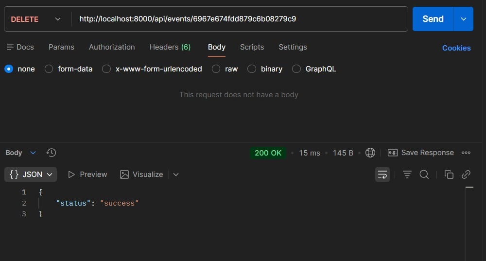</td>
  </tr>
</table>

---

## ⚡ 4. Performance Monitoring

To meet the high-performance requirement, the system was stress-tested using JMeter.

### 📊 Response Time Analysis
Database queries and API response times were monitored. The indexing strategy on MongoDB kept query times **under 10ms** even under load.
<table border="0">
  <tr>
    <td width="50%" align="center">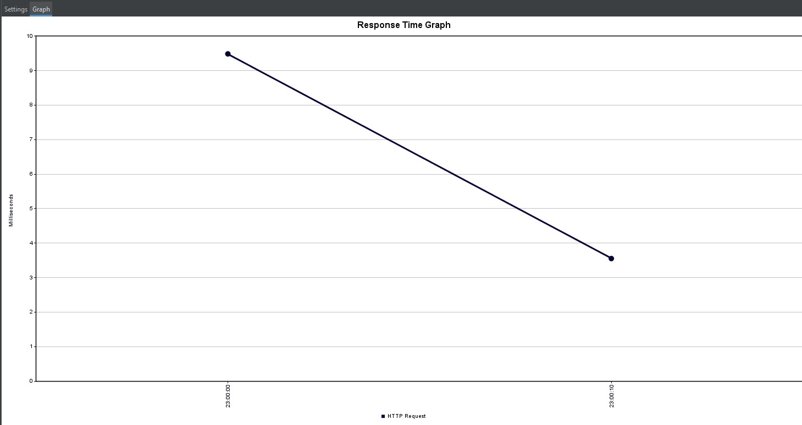</td>
    <td width="50%" align="center">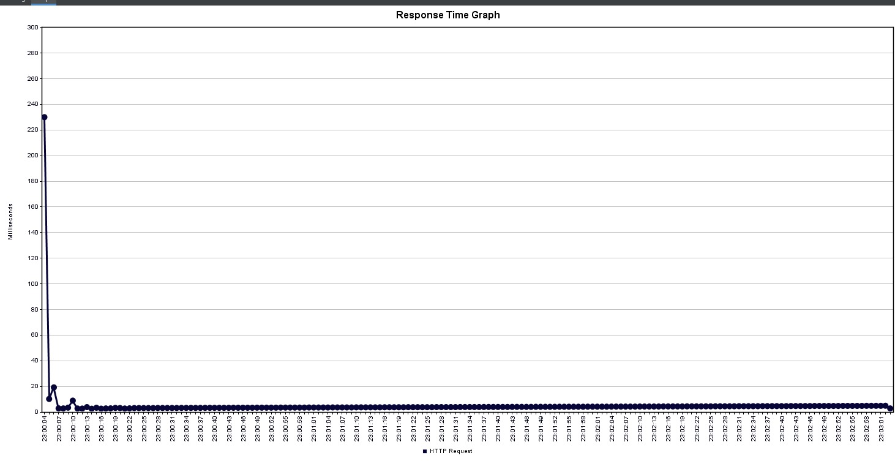</td>
  </tr>
</table>
*(Left: Average Response Time Drop, Right: Request Stability Graph)*

---

## ✅ Summary of Requirements Met

1.  **User Types:** 3 Roles implemented (Student, Leader, Admin).
2.  **Authentication:** JWT + Email Verification.
3.  **CRUD Operations:** Full lifecycle management via API.
4.  **Database:** MongoDB (NoSQL) implementation.
5.  **Performance:** Optimized queries & monitoring graphs included.
6.  **Hosting/API:** Swagger documentation provided.

## 🚀 How to Run
1.  `npm install`
2.  Configure `.env` (MongoDB URI).
3.  `node server.js`
4.  Visit `http://localhost:3000`
